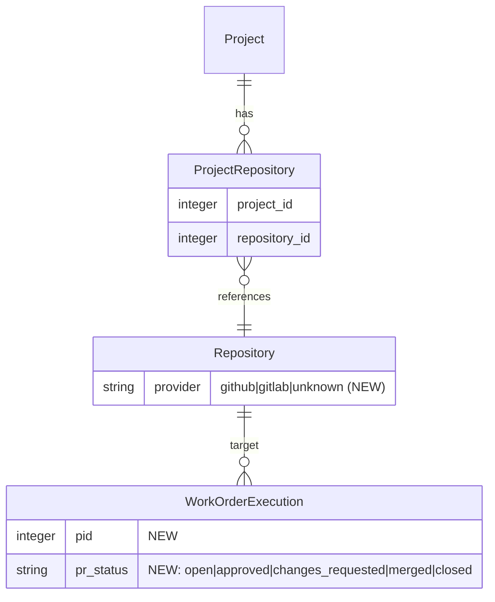

# Demo-Ready Platform

## Overview

Get Constitution to a state where it can be dogfooded by an internal team as a real SDLC platform. A product manager should be able to: onboard a project, connect repositories (GitHub and GitLab), create feature requests, have coding agents implement them with PRs/MRs, get automated QA feedback, and explore the system architecture visually.

This is a multi-phase initiative. The platform already has strong foundations (CRUD, repo indexing, AI chat, work order execution, knowledge graph). This plan focuses on closing gaps, adding missing capabilities, and polishing the end-to-end workflow.

## Problem Statement / Motivation

Constitution has been built rapidly (~5 days) with impressive breadth but several critical gaps prevent real-world use:

1. **No onboarding flow** -- new users can't create teams or bootstrap projects without Rails console
2. **GitHub-only** -- work order execution creates PRs via `gh` CLI; no GitLab support
3. **No QA pipeline** -- the flow ends at "PR created" with no automated quality gate
4. **Architecture discovery is data-only** -- Neo4j graph and extracted artifacts exist but have no user-facing visualization beyond the basic system map
5. **Several bugs** -- execution_log_controller not registered in Stimulus, work order status not reverted on failure, branch collision on re-execution
6. **Missing observability** -- no live indexing progress, no notifications for async operations

## Proposed Solution

Six phases, ordered by dependency and demo impact:

| Phase | Name | Focus | Effort |
|-------|------|-------|--------|
| 1 | Foundation Fixes | Bug fixes, onboarding, critical gaps | Small |
| 2 | GitLab Support | VCS provider abstraction, `glab` integration | Medium |
| 3 | Agent Execution Hardening | Reliability, observability, re-execution | Small |
| 4 | QA/Validation Pipeline | PR review agent, test runner, feedback loop | Large |
| 5 | Architecture Discovery | Mermaid diagrams, dependency explorer | Medium |
| 6 | Polish & Demo Prep | Notifications, empty states, guided flows | Small |

## Technical Approach

### Architecture

#### VCS Provider Abstraction (Phase 2)

New `provider` enum on `Repository` model. Abstract PR/MR creation into a strategy pattern:

```
Repository (provider: :github | :gitlab | :unknown)
  -> VcsProviderService.for(repository)
     -> GithubProviderService (uses `gh` CLI)
     -> GitlabProviderService (uses `glab` CLI)
```

#### QA Pipeline Architecture (Phase 4)

```
WorkOrderExecution (completed, has PR URL)
  -> PrValidationJob (triggered on completion)
     -> fetches diff (gh pr diff / glab mr diff)
     -> MrReviewService
        -> static checks (large diff, missing tests, artifact impacts)
        -> AI review (diff + acceptance criteria -> findings)
     -> posts review comments (gh api / glab api)
     -> creates FeedbackItem in Constitution
  -> PrStatusTrackingJob (polling, every 5 min)
     -> checks PR state (open/merged/closed)
     -> updates WorkOrderExecution.pr_status
     -> notifies PM on state change
```

#### Mermaid Generation Architecture (Phase 5)

Two approaches, used together:

1. **Deterministic generation** from extracted artifacts -- routes/controllers/services/models grouped into flowcharts
2. **AI-assisted generation** via OpenRouter -- for complex sequence diagrams where static analysis can't infer call chains

```
MermaidGenerator (deterministic)
  -> dependency_flowchart (from ExtractedArtifacts grouped by type)
  -> model_class_diagram (from model artifacts)

AiDiagramGenerator (LLM-assisted)
  -> sequence_diagram_for_route(route_artifact, related_artifacts)
  -> system_interaction_diagram(service_system)
```

### Implementation Phases

---

#### Phase 1: Foundation Fixes

**Goal:** Remove blockers so the basic PM flow works end-to-end.

##### 1.1 Team Onboarding Flow

**Problem:** `User belongs_to :team` is required but there's no team creation UI. New users cannot sign up.

**Solution:** Add a post-registration setup wizard. After Devise sign-up, redirect to `/onboarding` if user has no team.

**Files:**
- `app/controllers/onboarding_controller.rb` -- step-based wizard (create team -> create first project)
- `app/views/onboarding/new.html.erb` -- team name + first project form
- Update `app/controllers/application_controller.rb` -- `after_sign_in_path_for` redirects to onboarding if no team

**Acceptance Criteria:**
- [x] New user signs up, lands on onboarding wizard
- [x] Wizard creates team and first project in one step
- [x] After onboarding, user lands on project dashboard
- [x] Existing users with teams skip onboarding
- [x] `spec/requests/onboarding_spec.rb` passes

##### 1.2 Register execution_log_controller in Stimulus

**Problem:** `execution_log_controller.js` exists but is not imported in `app/javascript/controllers/index.js`. Live log streaming silently fails.

**Solution:** Add import and registration.

**Files:**
- `app/javascript/controllers/index.js` -- add `import ExecutionLogController from "./execution_log_controller"` and register

**Acceptance Criteria:**
- [x] Execution log controller connects when work order show page loads
- [x] Live log streaming displays in browser during agent execution

##### 1.3 Fix Work Order Status on Execution Failure

**Problem:** Work order stays at `in_progress` after execution fails. No way to retry without manual edit.

**Solution:** In `WorkOrderExecutionJob#fail_execution`, revert work order status to `todo`.

**Files:**
- `app/jobs/work_order_execution_job.rb:fail_execution` -- add `@work_order.update!(status: :todo)`

**Acceptance Criteria:**
- [x] Failed execution reverts work order to `todo`
- [x] PM can click "Run Agent" again after failure
- [x] `spec/jobs/work_order_execution_job_spec.rb` updated

##### 1.4 Fix Branch Collision on Re-execution

**Problem:** Branch name is deterministic (`wo-{id}-{slug}`). Re-execution collides with existing remote branch.

**Solution:** Append execution ID to branch name: `wo-{id}-{slug}-e{execution_id}`.

**Files:**
- `app/services/work_order_prompt_builder.rb` -- update `branch_name` method
- `app/models/work_order_execution.rb` -- store computed branch name

**Acceptance Criteria:**
- [x] Each execution gets a unique branch name
- [x] Re-execution after failure creates a new branch
- [x] `spec/services/work_order_prompt_builder_spec.rb` updated

##### 1.5 Fix Default Branch Detection

**Problem:** `GitImporter#detect_default_branch` hardcodes `"main"`. Repos using `master` or other defaults fail.

**Solution:** Use `git ls-remote --symref {url} HEAD` to detect the actual default branch.

**Files:**
- `app/services/importers/git_importer.rb:detect_default_branch`

**Acceptance Criteria:**
- [x] Repos with `master` default branch clone successfully
- [x] Repos with custom default branches clone successfully
- [x] `spec/services/importers/git_importer_spec.rb` updated

##### 1.6 Repository URL Validation

**Problem:** No validation on repository URL. Invalid URLs reach `git clone` and fail with opaque errors.

**Solution:** Add URL format validation to Repository model. Accept HTTPS and SSH git URLs.

**Files:**
- `app/models/repository.rb` -- add URL format validation
- `app/services/importers/git_importer.rb` -- validate before clone

**Acceptance Criteria:**
- [x] Invalid URLs rejected with clear error message
- [x] SSH URLs (`git@github.com:owner/repo.git`) accepted
- [x] HTTPS URLs (`https://github.com/owner/repo.git`) accepted
- [x] Duplicate URL detection prevents double-import

---

#### Phase 2: GitLab Support

**Goal:** Abstract VCS operations so both GitHub and GitLab work for PR/MR creation.

##### 2.1 Add Provider Field to Repository

**Solution:** Add `provider` enum to Repository model. Auto-detect from remote URL on import.

**Files:**
- `db/migrate/TIMESTAMP_add_provider_to_repositories.rb` -- add `provider` enum column
- `app/models/repository.rb` -- `enum :provider, { github: 0, gitlab: 1, unknown: 2 }`
- `app/services/importers/git_importer.rb` -- detect provider from URL pattern

**Detection logic:**
```ruby
def detect_provider(url)
  case url
  when /github\.com/  then :github
  when /gitlab\.com/  then :gitlab
  else :unknown
  end
end
```

**Acceptance Criteria:**
- [x] Repository model has `provider` enum
- [x] GitImporter auto-detects provider from URL
- [x] `github.com` URLs -> `:github`, `gitlab.com` URLs -> `:gitlab`
- [x] Self-hosted URLs default to `:unknown`

##### 2.2 VCS Provider Service Abstraction

**Solution:** Extract PR/MR creation into provider-specific service classes.

**Files:**
- `app/services/vcs/base_provider.rb` -- interface: `create_merge_request(branch:, title:, body:)`, `diff(pr_number:)`, `post_review_comment(pr_number:, body:, file:, line:)`
- `app/services/vcs/github_provider.rb` -- wraps `gh` CLI
- `app/services/vcs/gitlab_provider.rb` -- wraps `glab` CLI
- `app/services/vcs/provider_factory.rb` -- `VCS::ProviderFactory.for(repository)` returns correct provider

**GitHub provider (existing logic extracted):**
```ruby
class Vcs::GithubProvider < Vcs::BaseProvider
  def create_merge_request(branch:, title:, body:)
    system("gh", "pr", "create", "--title", title, "--body", body, "--base", default_branch, chdir: repo_path)
  end
end
```

**GitLab provider (new):**
```ruby
class Vcs::GitlabProvider < Vcs::BaseProvider
  def create_merge_request(branch:, title:, body:)
    system("glab", "mr", "create", "--title", title, "--description", body,
           "--target-branch", default_branch, "--yes", chdir: repo_path)
  end
end
```

**Acceptance Criteria:**
- [x] `WorkOrderExecutionJob` uses `VCS::ProviderFactory.for(repository)` instead of direct `gh` calls
- [x] GitHub repos create PRs via `gh pr create`
- [x] GitLab repos create MRs via `glab mr create`
- [x] Unknown provider fails gracefully with descriptive error
- [x] `spec/services/vcs/github_provider_spec.rb` passes
- [x] `spec/services/vcs/gitlab_provider_spec.rb` passes

##### 2.3 GitLab Authentication Setup

**Solution:** Support `GITLAB_TOKEN` environment variable for `glab` authentication. Add configuration guidance.

**Files:**
- `app/services/vcs/gitlab_provider.rb` -- set `GITLAB_TOKEN` env var from team/project config
- `.env.example` -- document `GITLAB_TOKEN` variable
- Update `CLAUDE.md` with GitLab setup instructions

**Acceptance Criteria:**
- [x] `glab` authenticates via `GITLAB_TOKEN` env var
- [x] Clear error message if `glab` CLI not installed
- [x] Clear error message if `GITLAB_TOKEN` not set

##### 2.4 Update Agent Prompt for GitLab

**Solution:** Modify `WorkOrderPromptBuilder` to use correct terminology (MR vs PR) based on provider.

**Files:**
- `app/services/work_order_prompt_builder.rb` -- conditional prompt sections based on `repository.provider`

**Acceptance Criteria:**
- [x] GitHub repos: prompt says "Pull Request"
- [x] GitLab repos: prompt says "Merge Request"
- [x] Agent instructions reference correct CLI tool

---

#### Phase 3: Agent Execution Hardening

**Goal:** Make agent execution reliable and observable for real-world use.

##### 3.1 Live Indexing Progress via ActionCable

**Problem:** PM stares at static "Pending" badge during indexing. No progress feedback.

**Solution:** Broadcast indexing status changes and progress via `ProjectChannel`.

**Files:**
- `app/jobs/codebase_index_job.rb` -- broadcast phase transitions and file count progress
- `app/views/projects/show.html.erb` -- add Turbo Stream target for indexing status
- `app/javascript/controllers/indexing_progress_controller.js` -- Stimulus controller to update UI

**Broadcast format:**
```ruby
ProjectChannel.broadcast_to(project, {
  type: "indexing_progress",
  repository_id: repo.id,
  status: "indexing",
  phase: "parsing_files",  # cloning | parsing_files | generating_embeddings | complete
  progress: "150/2000 files"
})
```

**Acceptance Criteria:**
- [x] Project show page updates live during indexing
- [x] Shows current phase (cloning, parsing, embeddings)
- [x] Shows file count progress during parsing
- [x] Status badge updates without page refresh

##### 3.2 Execution Cancellation

**Problem:** No way to stop a running execution. 10-minute timeout is only escape.

**Solution:** Store the process PID on the execution record. Add a "Cancel" button that sends SIGTERM.

**Files:**
- `db/migrate/TIMESTAMP_add_pid_to_work_order_executions.rb` -- add `pid` integer column
- `app/jobs/work_order_execution_job.rb` -- store `Process.pid` of spawned claude process
- `app/controllers/work_orders_controller.rb` -- add `cancel_execution` action
- `app/views/work_orders/_execution_panel.html.erb` -- add Cancel button (visible when running)

**Acceptance Criteria:**
- [x] Running execution shows Cancel button
- [x] Cancel sends SIGTERM to claude process
- [x] Execution marked as `failed` with "Cancelled by user" message
- [x] Work order reverted to `todo`

##### 3.3 Reduce Log Streaming DB Writes

**Problem:** Every line of agent output triggers `update_column(:log, output)`. Heavy DB load.

**Solution:** Batch log writes. Buffer lines in memory, flush to DB every 2 seconds or every 50 lines.

**Files:**
- `app/jobs/work_order_execution_job.rb` -- add buffered log writer

**Acceptance Criteria:**
- [x] DB writes reduced by ~90% during execution
- [x] Log still broadcasts to ActionCable in real-time (unbatched)
- [x] Full log persisted to DB on completion/failure

##### 3.4 Notifications for Async Operations

**Problem:** No notifications when indexing completes, execution finishes, or PR is created.

**Solution:** Create `Notification` records on key events. Wire up the existing `NotificationChannel` and `notifications_controller.js`.

**Files:**
- `app/jobs/codebase_index_job.rb` -- create notification on completion/failure
- `app/jobs/work_order_execution_job.rb` -- create notification on completion/failure with PR link
- `app/models/notification.rb` -- verify broadcast_on_create works

**Acceptance Criteria:**
- [x] Toast notification appears when indexing completes
- [x] Toast notification appears when agent execution completes (with PR link)
- [x] Toast notification appears on execution failure
- [x] Notifications visible in notification dropdown

---

#### Phase 4: QA/Validation Pipeline

**Goal:** Automated quality gate after PR/MR creation. Agent reviews code against acceptance criteria, runs basic checks, and posts feedback.

##### 4.1 PR Validation Job

**Solution:** After a successful work order execution, trigger a validation job that reviews the PR.

**Files:**
- `app/jobs/pr_validation_job.rb` -- orchestrates the review pipeline
- `app/services/mr_review_service.rb` -- performs the actual review logic
- `app/services/vcs/base_provider.rb` -- add `diff(pr_identifier:)` and `post_review(pr_identifier:, body:, comments:)` methods
- `app/services/vcs/github_provider.rb` -- implement diff and review via `gh` API
- `app/services/vcs/gitlab_provider.rb` -- implement diff and review via `glab` API

**Review pipeline:**
1. Fetch PR/MR diff
2. Run static checks:
   - Large diff warning (>500 changed lines)
   - Missing test files for changed source files
   - High-impact artifact changes (routes, API clients)
3. AI review: send diff + work order acceptance criteria to Claude Sonnet, get structured findings
4. Post review as GitHub PR review / GitLab MR discussion
5. Create `FeedbackItem` in Constitution with review summary

**AI Review Prompt:**
```
Review this code change against the acceptance criteria below.

## Acceptance Criteria
{work_order.acceptance_criteria}

## Diff
{pr_diff}

Check for:
1. Does the implementation satisfy each acceptance criterion?
2. Are there security issues (injection, auth bypass, data exposure)?
3. Are there obvious performance problems?
4. Are tests included for the changes?

Return your findings as JSON:
{
  "overall": "approve" | "request_changes",
  "summary": "...",
  "criteria_met": [{"criterion": "...", "met": true/false, "comment": "..."}],
  "issues": [{"severity": "error|warning|info", "file": "...", "line": N, "message": "..."}]
}
```

**Acceptance Criteria:**
- [x] `PrValidationJob` triggers automatically after successful execution
- [x] Review checks PR diff against work order acceptance criteria
- [x] Review comments posted to GitHub PR / GitLab MR
- [x] `FeedbackItem` created in Constitution with review findings
- [x] Review distinguishes approve vs request_changes
- [x] `spec/jobs/pr_validation_job_spec.rb` passes
- [x] `spec/services/mr_review_service_spec.rb` passes

##### 4.2 PR Status Tracking

**Solution:** Poll PR/MR status periodically and update the execution record.

**Files:**
- `db/migrate/TIMESTAMP_add_pr_status_to_work_order_executions.rb` -- add `pr_status` enum (open, approved, changes_requested, merged, closed)
- `app/jobs/pr_status_tracking_job.rb` -- polls every 5 minutes for open PRs
- `app/services/vcs/base_provider.rb` -- add `pr_status(pr_identifier:)` method
- `app/views/work_orders/_execution_panel.html.erb` -- show PR status badge

**Acceptance Criteria:**
- [x] PR status displayed on work order show page
- [x] Status updates automatically via polling job
- [x] Notification sent when PR is merged or changes requested
- [x] Polling stops when PR is merged or closed

##### 4.3 Re-trigger Agent from Review Feedback

**Solution:** When a PR review requests changes, allow the PM to re-trigger the agent with the review feedback included in the prompt context.

**Files:**
- `app/services/work_order_prompt_builder.rb` -- include previous execution's review feedback in prompt
- `app/views/work_orders/_execution_panel.html.erb` -- "Re-run with feedback" button
- `app/controllers/work_orders_controller.rb` -- `execute` action supports `include_feedback: true` param

**Prompt addition:**
```
## Previous Attempt Feedback
The previous implementation received the following review feedback:
{review_comments}

Address these issues in your implementation.
```

**Acceptance Criteria:**
- [x] "Re-run with feedback" button visible when PR has review comments
- [x] New execution includes previous review feedback in prompt
- [x] Agent addresses review feedback in new implementation
- [x] New branch created (no collision with previous)

##### 4.4 Test Execution Integration (Stretch)

**Solution:** After the agent creates a PR, run the project's test suite and report results.

**Files:**
- `app/jobs/test_execution_job.rb` -- runs test suite in repo directory, captures output
- `app/services/vcs/base_provider.rb` -- add `post_check_status(pr_identifier:, name:, status:, output:)`

**Note:** This is stretch scope. The agent already runs tests as part of its instructions. This phase adds explicit test execution tracking visible in Constitution.

**Acceptance Criteria:**
- [ ] Test results displayed on execution panel
- [ ] Test failure details posted as PR comment
- [ ] Constitution tracks pass/fail status

---

#### Phase 5: Architecture Discovery

**Goal:** Auto-generate visual architecture diagrams and provide interactive dependency exploration.

##### 5.1 Mermaid Flowchart from Extracted Artifacts

**Solution:** Deterministic Mermaid flowchart generator that groups extracted artifacts by type and shows relationships.

**Files:**
- `app/services/mermaid_generator.rb` -- generates Mermaid syntax from `ExtractedArtifact` records
- `app/controllers/repositories_controller.rb` -- add `architecture` action
- `app/views/repositories/architecture.html.erb` -- renders Mermaid diagram

**Generation logic:**
```ruby
class MermaidGenerator
  def dependency_flowchart(repository)
    artifacts = repository.codebase_files.flat_map(&:extracted_artifacts)
    grouped = artifacts.group_by(&:artifact_type)

    lines = ["flowchart TD"]
    grouped.each do |type, arts|
      lines << "    subgraph #{type.titleize.pluralize}"
      arts.each { |a| lines << "        #{node_id(a)}#{shape(type)}\"#{a.name}\"#{close_shape(type)}" }
      lines << "    end"
    end
    # Infer edges from code references (controller -> service, service -> model)
    add_inferred_edges(lines, artifacts)
    lines.join("\n")
  end
end
```

**Acceptance Criteria:**
- [ ] Repository architecture page shows Mermaid flowchart
- [ ] Artifacts grouped by type (routes, controllers, services, models, etc.)
- [ ] Edges inferred from code content (e.g., controller referencing a service class)
- [ ] Diagram renders via existing Mermaid Stimulus controller
- [ ] Diagram regenerates when repository is re-indexed

##### 5.2 AI-Assisted Sequence Diagrams

**Solution:** Use OpenRouter to generate sequence diagrams for specific routes/features.

**Files:**
- `app/services/ai_diagram_generator.rb` -- sends artifacts + source code to LLM, gets Mermaid back
- `app/controllers/repositories_controller.rb` -- add `generate_diagram` action (AJAX)
- `app/views/repositories/architecture.html.erb` -- "Generate sequence diagram" button per route

**Acceptance Criteria:**
- [ ] PM clicks a route artifact and gets a sequence diagram
- [ ] Diagram shows request flow: route -> controller -> service -> model -> external
- [ ] Diagram renders inline on the architecture page
- [ ] Generated diagrams cached (regenerate on re-index)

##### 5.3 Interactive Dependency Explorer

**Solution:** UI that wraps `GraphService.neighbors` and `GraphService.impact_analysis` in an explorable interface.

**Files:**
- `app/controllers/graph_explorer_controller.rb` -- JSON API for graph queries
- `app/views/graph_explorer/show.html.erb` -- interactive explorer page
- `app/javascript/controllers/graph_explorer_controller.js` -- click-to-explore D3 visualization

**Interaction model:**
1. Page loads with the project's service systems as root nodes (D3 force graph)
2. Click a node -> expand to show its neighbors (documents, blueprints, artifacts)
3. Click "Impact Analysis" -> highlight all transitively connected nodes
4. Sidebar shows details of selected node

**Acceptance Criteria:**
- [ ] Explorer accessible from project navigation
- [ ] Click node to expand neighbors
- [ ] Impact analysis highlights affected nodes
- [ ] Sidebar shows node details (type, name, properties)
- [ ] Works with both Neo4j data and PostgreSQL fallback
- [ ] `spec/controllers/graph_explorer_controller_spec.rb` passes

##### 5.4 Auto-Generate System Dependencies

**Problem:** `SystemDependency` records must be manually created. System map is empty for new projects.

**Solution:** Infer system dependencies from extracted artifacts (api_client artifacts reference external systems, queue_publisher/consumer pairs indicate messaging dependencies).

**Files:**
- `app/services/dependency_inferrer.rb` -- analyzes artifacts to create SystemDependency records
- `app/jobs/codebase_index_job.rb` -- call `DependencyInferrer` after artifact extraction

**Acceptance Criteria:**
- [ ] API client artifacts create dependencies to external systems
- [ ] Queue publisher/consumer pairs create messaging dependencies
- [ ] System map populated automatically after indexing
- [ ] Manual dependencies preserved (not overwritten)

---

#### Phase 6: Polish & Demo Prep

**Goal:** Smooth the rough edges for dogfooding use.

##### 6.1 Empty State Guidance

**Solution:** Add helpful empty states with clear CTAs throughout the app.

**Files:**
- `app/views/projects/show.html.erb` -- empty state for no repos, no work orders
- `app/views/work_orders/index.html.erb` -- empty state for no work orders
- `app/views/shared/_empty_state.html.erb` -- reusable empty state partial

**Acceptance Criteria:**
- [ ] Every list view has a helpful empty state
- [ ] Empty states include a clear call-to-action
- [ ] First-time project shows "Connect a repository to get started"

##### 6.2 Navigation Improvements

**Solution:** Add cross-links between related entities.

**Files:**
- `app/views/work_orders/show.html.erb` -- link to target repository, PR URL
- `app/views/projects/show.html.erb` -- link to work order kanban, architecture view
- `app/views/layouts/_navigation.html.erb` -- add Architecture and Graph Explorer links

**Acceptance Criteria:**
- [ ] Work order -> linked PR/MR (clickable)
- [ ] Work order -> target repository
- [ ] Project dashboard -> architecture view
- [ ] Project dashboard -> kanban board
- [ ] Main nav includes Architecture link

##### 6.3 Document Import UI

**Problem:** `DocumentImporter` service exists but has no UI.

**Solution:** Add file upload form to documents index page.

**Files:**
- `app/controllers/documents_controller.rb` -- add `import` action
- `app/views/documents/index.html.erb` -- add "Import Document" button with file upload
- Active Storage attachment on Document model for source files

**Acceptance Criteria:**
- [ ] Upload .md, .docx, or .pdf files
- [ ] Imported content creates a new Document with AI-restructured body
- [ ] Original file attached for reference

##### 6.4 Project Scoping for Repositories

**Problem:** Repositories belong to teams, not projects. Multi-project teams see all repos.

**Solution:** Add a join table `project_repositories` so repositories can be scoped to projects.

**Files:**
- `db/migrate/TIMESTAMP_create_project_repositories.rb`
- `app/models/project_repository.rb`
- `app/models/project.rb` -- `has_many :repositories, through: :project_repositories`
- `app/services/importers/git_importer.rb` -- associate imported repo with current project

**Acceptance Criteria:**
- [ ] Repositories scoped to projects (not just teams)
- [ ] Work order execution selects from project's repos only
- [ ] Architecture view shows project's repos only

---

## System-Wide Impact

### Interaction Graph

- **Phase 1 fixes** are isolated to existing code paths (low risk)
- **Phase 2 (VCS abstraction)** touches `WorkOrderExecutionJob` which is the core autonomous agent path. Factory pattern keeps changes backward-compatible.
- **Phase 4 (QA pipeline)** introduces a new async pipeline (PrValidationJob) that triggers after WorkOrderExecutionJob. Failure in validation should NOT affect execution status.
- **Phase 5 (Architecture)** adds new read-only views. No impact on existing write paths.

### Error Propagation

- VCS provider failures (CLI not installed, auth missing) must fail gracefully with user-visible error messages, not silent no-ops
- QA pipeline failures should create a FeedbackItem noting the failure, not block the work order
- Mermaid generation failures should show a "diagram unavailable" message, not crash the page

### State Lifecycle Risks

- **Work order status transitions** need guards: can't execute a `done` work order, can't mark `in_progress` if an execution is already running
- **PR status tracking** uses polling (not webhooks). Stale data possible but acceptable for dogfooding
- **Branch collision** solved by Phase 1.4 (append execution ID)

### API Surface Parity

- VCS provider abstraction must implement the same interface for both GitHub and GitLab
- MCP server tools should be updated to reflect new capabilities (architecture diagrams, validation status)

### Integration Test Scenarios

1. **Full lifecycle:** Sign up -> create project -> import repo -> wait for indexing -> create work order -> run agent -> PR created -> validation runs -> feedback posted
2. **GitLab flow:** Import GitLab repo -> execute work order -> MR created via `glab` -> validation posts MR discussion
3. **Re-execution:** Agent fails -> work order reverts to todo -> re-run with feedback -> new PR created
4. **Architecture discovery:** Import repo -> indexing completes -> view architecture flowchart -> click route for sequence diagram -> explore graph

## Acceptance Criteria

### Functional Requirements

- [ ] New user can sign up, create team, create project without Rails console
- [ ] PM can import GitHub and GitLab repositories
- [ ] Indexing shows live progress and notifies on completion
- [ ] PM can create work orders and trigger agent execution
- [ ] Agent creates PRs (GitHub) or MRs (GitLab) on successful execution
- [ ] QA validation agent reviews PRs/MRs against acceptance criteria
- [ ] Review feedback posted as PR/MR comments
- [ ] PM can re-trigger agent with review feedback
- [ ] Architecture flowchart generated from extracted artifacts
- [ ] AI-generated sequence diagrams available per route
- [ ] Interactive dependency explorer shows graph relationships
- [ ] Document import via file upload

### Non-Functional Requirements

- [ ] Agent execution timeout configurable (default 10 min)
- [ ] Log streaming doesn't overwhelm DB (batched writes)
- [ ] Mermaid diagrams render under 3 seconds
- [ ] Polling jobs don't exceed 1 request/minute to external APIs

### Quality Gates

- [ ] All new features have request specs
- [ ] All new service objects have unit specs
- [ ] All new jobs have job specs
- [ ] No N+1 queries in new code paths
- [ ] Existing specs continue to pass

## Success Metrics

- A PM can complete the full lifecycle (project -> repo -> work order -> PR -> review) in under 30 minutes
- Agent execution succeeds on >80% of well-specified work orders
- QA validation catches at least 1 meaningful issue per review
- Architecture diagrams accurately represent the indexed codebase structure

## Dependencies & Prerequisites

- `glab` CLI must be installed on the server for GitLab support
- `GITLAB_TOKEN` env var for GitLab authentication
- `gh` CLI already required (existing dependency)
- `OPENROUTER_API_KEY` for AI features (existing dependency)
- Neo4j must be running for graph explorer (existing dependency, graceful fallback if unavailable)

## Risk Analysis & Mitigation

| Risk | Likelihood | Impact | Mitigation |
|------|-----------|--------|------------|
| `glab` CLI behaves differently than `gh` | Medium | Medium | Abstract behind common interface, test both paths |
| AI review produces low-quality feedback | Medium | Low | Include acceptance criteria in prompt, iterate on prompt quality |
| Mermaid diagrams too complex for large repos | High | Medium | Limit to 40 nodes per diagram, split into sub-diagrams |
| Agent execution unreliable on complex work orders | Medium | High | Improve prompt builder, add retry with feedback loop |
| Neo4j unavailable in some environments | Low | Low | `GraphService.available?` check already exists, add fallback to PostgreSQL queries |

## ERD: New Models and Relationships



## Future Considerations

- **Webhook-based PR status** instead of polling (GitHub webhooks, GitLab webhooks)
- **Visual verification** via browser automation (Cursor-style remote computer use) -- evaluate after core QA pipeline is stable
- **Collaborative editing** via TipTap collaboration extension
- **Slack/Discord notifications** for team awareness
- **Template system** for documents and blueprints
- **Incremental re-indexing** on git push webhooks

## Documentation Plan

- Update `CLAUDE.md` with new architecture (VCS providers, QA pipeline, architecture views)
- Add `.env.example` entries for `GITLAB_TOKEN`
- Add setup instructions for `glab` CLI installation

## Sources & References

### Internal References

- Existing execution job: `app/jobs/work_order_execution_job.rb`
- VCS operations: `app/jobs/work_order_execution_job.rb:open_pull_request`
- Mermaid controller: `app/javascript/controllers/mermaid_controller.js`
- Graph service: `app/services/graph_service.rb`
- Context builder: `app/services/context_builder.rb`
- Code parser: `app/services/code_parser.rb`

### External References

- GitLab CLI (`glab`): https://docs.gitlab.com/cli/
- `glab mr create`: https://docs.gitlab.com/cli/mr/create/
- Mermaid syntax: https://mermaid.js.org/
- Reviewdog (linter bridge): https://github.com/reviewdog/reviewdog
- CodeRabbit (AI review): https://www.coderabbit.ai/

### Related Plans

- `docs/plans/2026-02-25-constitution-design.md` -- original design document
- `docs/plans/2026-02-27-work-order-execution-design.md` -- execution feature design
- `docs/plans/2026-02-25-constitution-implementation.md` -- initial implementation plan
